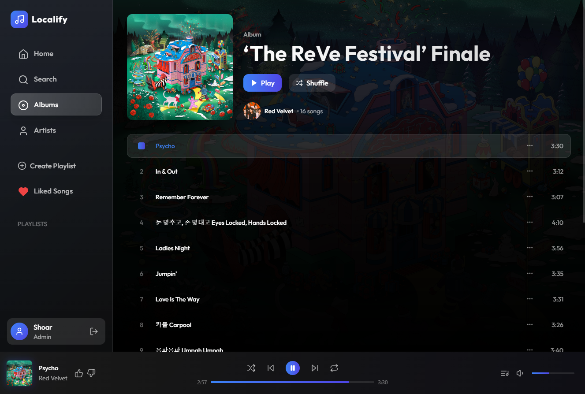

# Localify

A modern web application for managing and streaming your local music library.

Localify allows you to index your music library and stream it to your browser. You can create playlists, like music and curate your own music library.

It also include nice UI/UX for searching and browsing your music library.



The software is super lightweight and can run on your local machine or hosted in a docker container somewhere. Supports users and authentication.

## Project Structure

- `localify-client/`: React-based frontend application
- `localify-server/`: Hono-based backend server
- `data/`: Storage for database and media files

## Prerequisites

- Node.js 20.x or later
- npm 9.x or later
- Docker and Docker Compose (for containerized deployment)

## Local Development

### Setting up the Environment

1. Clone the repository:
```bash
git clone <repository-url>
cd localify
```

2. Copy the example environment file:
```bash
cp .env.example .env
```

3. Update the `.env` file
- Generate a secure `JWT_SECRET`

### Running the Server

1. Navigate to the server directory:
```bash
cd localify-server
```

2. Install dependencies:
```bash
npm install
```

3. Start the development server:
```bash
npm run dev
```

The server will be available at http://localhost:3000

### Running the Client

1. In a new terminal, navigate to the client directory:
```bash
cd localify-client
```

2. Install dependencies:
```bash
npm install
```

3. Start the development server:
```bash
npm run dev
```

The client will be available at http://localhost:5173

## Docker Deployment

### Prerequisites
- Docker
- Docker Compose

### Running with Docker Compose

1. Copy the example environment file if you haven't already:
```bash
cp .env.example .env
```

2. Update the `.env` file:
- Set `MEDIA_PATH` to your music library location
- Generate a secure `JWT_SECRET`
- Set `VITE_API_URL` to your server's URL (e.g., http://localhost:3000)

3. Create necessary directories:
```bash
mkdir -p data/storage data/media
```

4. Build and start the containers:
```bash
docker-compose up --build
```

The application will be available at http://localhost:3000

### Environment Variables

#### Server Configuration
- `PORT`: Server port (default: 3000)
- `NODE_ENV`: Environment mode (development/production)
- `STORAGE_PATH`: Path for application storage
- `MEDIA_PATH`: Path to your music library
- `DB_NAME`: SQLite database filename
- `JWT_SECRET`: Secret key for JWT tokens

#### Client Configuration
- `VITE_API_URL`: Backend API URL

## Development Notes

- The server uses SQLite for data storage
- Media files are served from the configured `MEDIA_PATH`
- The client is built with Vite and React
- API documentation is available at http://localhost:3000/docs (when running in development mode)

## Production Deployment

For production deployment:

1. Update environment variables for production:
- Set `NODE_ENV=production`
- Configure a secure `JWT_SECRET`
- Set appropriate paths for storage and media

2. Build and run with Docker Compose:
```bash
docker-compose -f docker-compose.yml up -d
```

## License

You may use this project for personal use.
